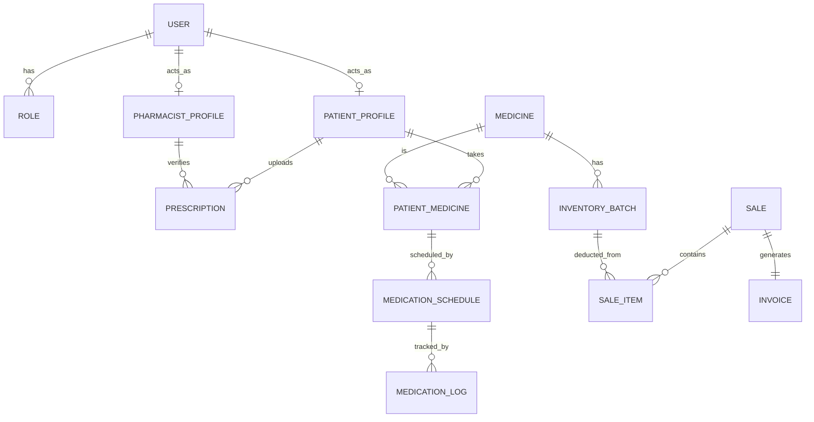
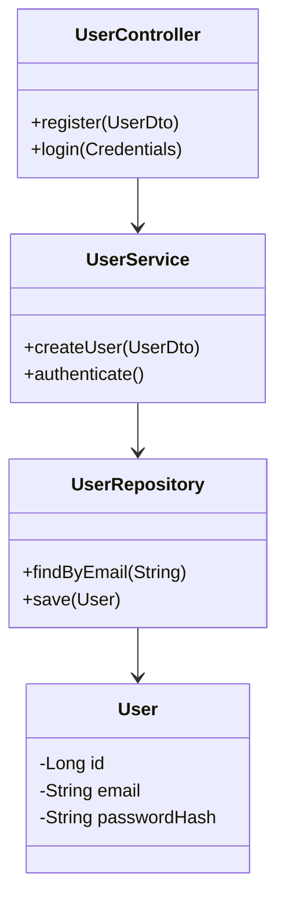
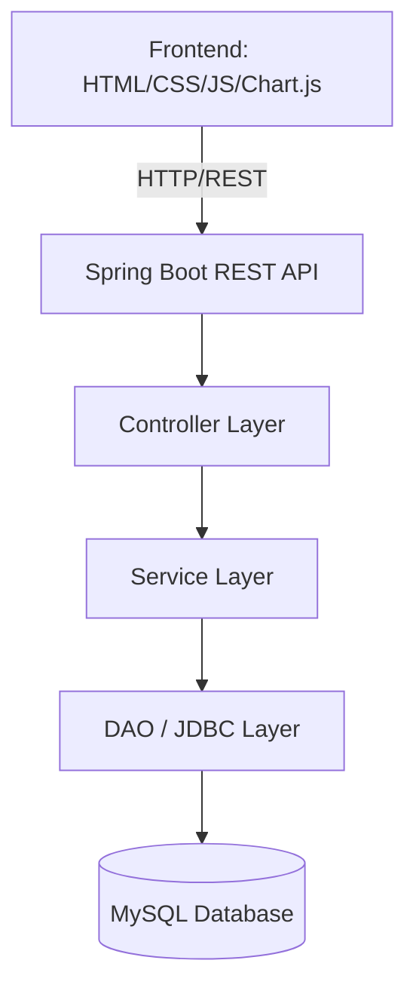
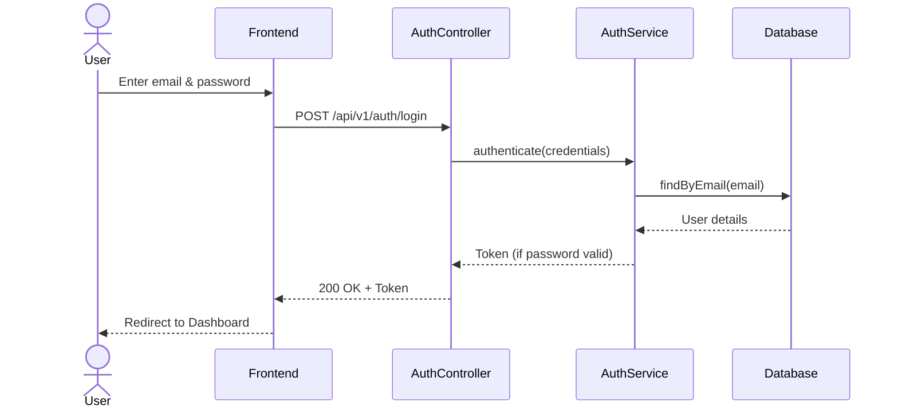
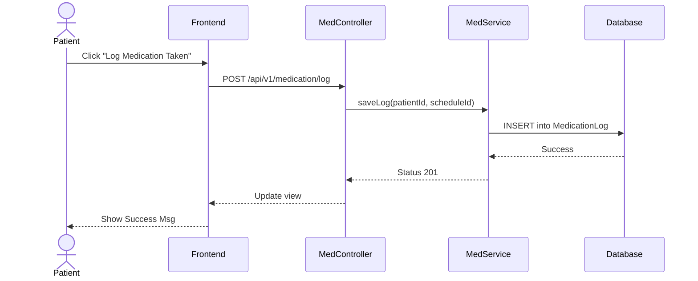
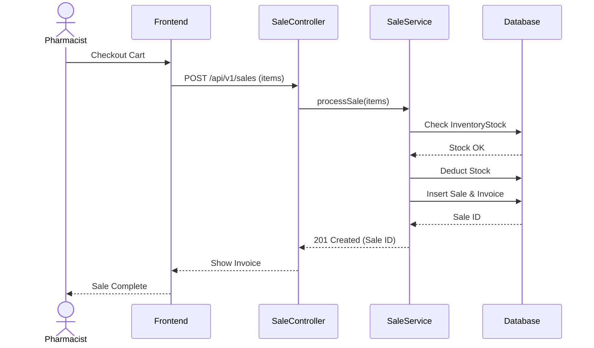
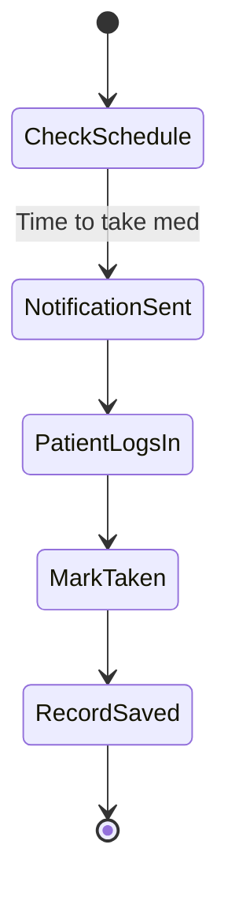
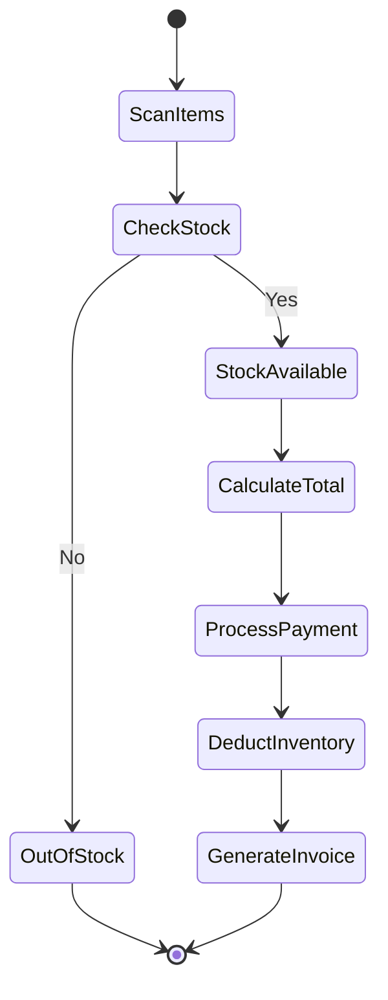

# MEDISYNC - Diagrams (Mermaid)

## 1. Use Case Diagram
```mermaid
usecaseDiagram
    actor Patient
    actor Pharmacist

    Patient --> (Register)
    Patient --> (Login)
    Patient --> (View Medicines)
    Patient --> (Upload Prescription)
    Patient --> (Log Medication)

    Pharmacist --> (Login)
    Pharmacist --> (Manage Inventory)
    Pharmacist --> (Verify Prescription)
    Pharmacist --> (Process Sale)
    Pharmacist --> (View Analytics)
```

## 2. ER Diagram


## 3. Class Diagram (Backend Snippet)


## 4. System Architecture Diagram


## 5. Login Sequence Diagram


## 6. Patient Medication Sequence Diagram


## 7. Pharmacy Sale Sequence Diagram


## 8. Patient Medication Activity Diagram


## 9. Pharmacy Sale Activity Diagram

